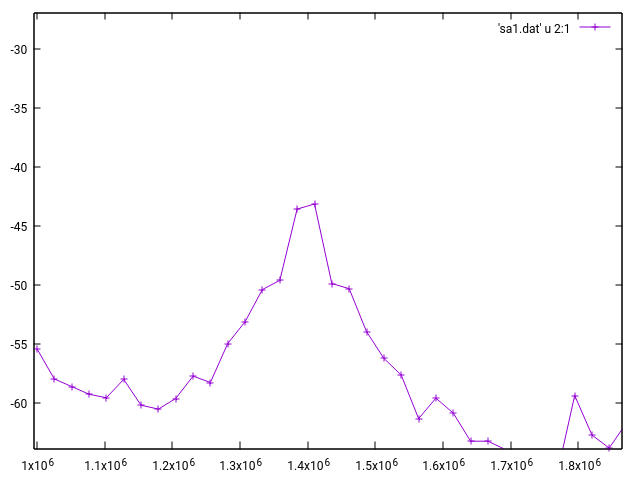
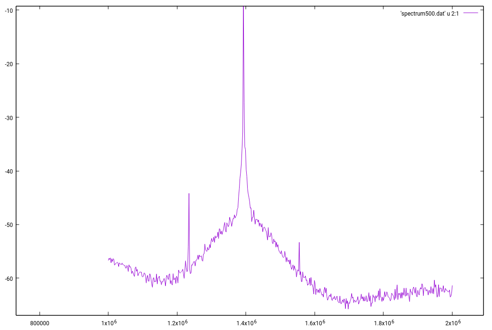

# tomorrow

Code to access a Morrow V9054 Spectrum Analyzer. This is Work In Progress.

src/morrow contains all Morrow specific code. 

src/morrow/include contains various required header files.

src/morrow/orig contains decompilation results for the original Windows 95 libraries. These files were created with RetDec decompiler and are a starting point for own code.

src/morrow/rpc* contains my try to use ONS/RPC together with the Morrow Spectrum Analyzer. This try failed because it seems the Word Serial Protocol (binary data stream) does not work via ONS/RPC.

For deeper discussion of `tomorrow` code, see [src/morrow/sa9054-info.md](src/morrow/sa9054-info.md).

## State of code:

With some tweaks, the basic function runs without errors, see [main.c](src/morrow/main.c). 
This file is an example program found in the Morrow documentation:

```c
#include <sicl.h>

#include <stdio.h>
#include <math.h>
#include <stdlib.h>

#include <sapform.h>
#include <sa_defin.h>
#include <str_9052.h>

#include <mr_defin.h>
#include <mrapp.h>

#include "helper.h"

int main(int argc, char **argv) {

	setLogLevel(LOG_INFO);

	char sessionString[50];
	ViChar message[128];
	ViStatus mr90xxStatus;
	ViSession sessionId;

	sprintf(sessionString, "vxi,126");

	mr90xxStatus = mr90xx_init(sessionString, VI_TRUE, VI_TRUE, &sessionId);
	if (mr90xxStatus != MR90XX_IE_SUCCESS) {
		printf("Error mr90xx_init\n");
		exit(-1);
	} else {
		printf("mr90xx_init OK\n\n");
	}

	mr90xxStatus = mr90xx_SetEngineModel(sessionId, SA9054);
	if (mr90xxStatus != MR90XX_IE_SUCCESS) {
		dlog(LOG_ERROR, "Error mr90xx_SetEngineModel\n");
		exit(-1);
	} else {
		dlog(LOG_INFO, "mr90xx_SetEngineModel OK\n\n");
	}

	ViInt16 number_points = 40;
	ViReal64 start_freq = 149000000;
	ViReal64 stop_freq = 150000000;
	ViInt16 ref_level = 2;
	mr90xxStatus = mr90xx_InitGuiSweep(sessionId, MR90XX_RBW_AUTO,
			MR90XX_VBW_AUTO, start_freq, stop_freq, ref_level, number_points);
	if (mr90xxStatus != MR90XX_IE_SUCCESS) {
		dlog(LOG_ERROR, "Error mr90xx_InitGuiSweep\n");
		exit(-1);
	} else {
		dlog(LOG_INFO, "mr90xx_InitGuiSweep OK\n\n");
	}

	setLogLevel(LOG_DEBUG);

	ViReal64 amp_array[40], freq_array[40];
	mr90xxStatus = mr90xx_MeasureAmplWithFreq(sessionId, MR90XX_RBW_AUTO,
		MR90XX_VBW_AUTO, start_freq, stop_freq, ref_level, number_points,
		MR90XX_SWP_MIN,
		MR90XX_DBM_FORMAT, amp_array, freq_array);
	if (mr90xxStatus != MR90XX_IE_SUCCESS) {
		dlog(LOG_ERROR, "Error mr90xx_MeasureAmplWithFreq\n");
	} else {
		dlog(LOG_INFO, "mr90xx_MeasureAmplWithFreq OK\n");
	}

	int i;
	for (i = 0; i < number_points; i++) {
		printf("Amplitude = %10.2f dBm, Frequency = %10.0f Hz\n", amp_array[i],
				freq_array[i]);
	}
}

```

main.c output, which looks nice when running code with no debug logging. If I do debug logging,
the amplitude values are wrong (always 42.x dBm):

```
Amplitude =     -58.05 dBm, Frequency =    1000000 Hz
Amplitude =     -57.36 dBm, Frequency =    1025641 Hz
Amplitude =     -58.87 dBm, Frequency =    1051282 Hz
Amplitude =     -58.15 dBm, Frequency =    1076923 Hz
Amplitude =     -59.13 dBm, Frequency =    1102564 Hz
Amplitude =     -59.31 dBm, Frequency =    1128205 Hz
Amplitude =     -60.41 dBm, Frequency =    1153846 Hz
Amplitude =     -59.25 dBm, Frequency =    1179487 Hz
Amplitude =     -60.37 dBm, Frequency =    1205128 Hz
Amplitude =     -58.38 dBm, Frequency =    1230769 Hz
Amplitude =     -56.74 dBm, Frequency =    1256410 Hz
Amplitude =     -54.05 dBm, Frequency =    1282051 Hz
Amplitude =     -51.81 dBm, Frequency =    1307692 Hz
Amplitude =     -50.77 dBm, Frequency =    1333333 Hz
Amplitude =     -48.34 dBm, Frequency =    1358974 Hz
Amplitude =     -34.76 dBm, Frequency =    1384615 Hz <-- My frequency generator runs at 1,385Mhz
Amplitude =     -47.90 dBm, Frequency =    1410256 Hz
Amplitude =     -51.17 dBm, Frequency =    1435897 Hz
Amplitude =     -51.58 dBm, Frequency =    1461538 Hz
Amplitude =     -55.66 dBm, Frequency =    1487179 Hz
Amplitude =     -55.73 dBm, Frequency =    1512820 Hz
Amplitude =     -58.32 dBm, Frequency =    1538461 Hz
Amplitude =     -59.84 dBm, Frequency =    1564102 Hz
Amplitude =     -62.11 dBm, Frequency =    1589743 Hz
Amplitude =     -62.80 dBm, Frequency =    1615384 Hz
Amplitude =     -65.15 dBm, Frequency =    1641025 Hz
Amplitude =     -64.59 dBm, Frequency =    1666666 Hz
Amplitude =     -65.74 dBm, Frequency =    1692307 Hz
Amplitude =     -66.73 dBm, Frequency =    1717948 Hz
Amplitude =     -66.82 dBm, Frequency =    1743589 Hz
Amplitude =     -68.91 dBm, Frequency =    1769230 Hz
Amplitude =     -67.42 dBm, Frequency =    1794871 Hz
Amplitude =     -68.31 dBm, Frequency =    1820512 Hz
Amplitude =     -70.87 dBm, Frequency =    1846153 Hz
Amplitude =     -69.09 dBm, Frequency =    1871794 Hz
Amplitude =     -71.15 dBm, Frequency =    1897435 Hz
Amplitude =     -71.23 dBm, Frequency =    1923076 Hz
Amplitude =     -71.23 dBm, Frequency =    1948717 Hz
Amplitude =     -71.72 dBm, Frequency =    1974358 Hz
Amplitude =     -70.95 dBm, Frequency =    1999999 Hz


```
A 40 point spectrum was fed into gnuplot:



A 500 points spectrum in the same range:


See Makefile for build targets.

Build with
	`make`

Run with
	`./morrow`
	
	